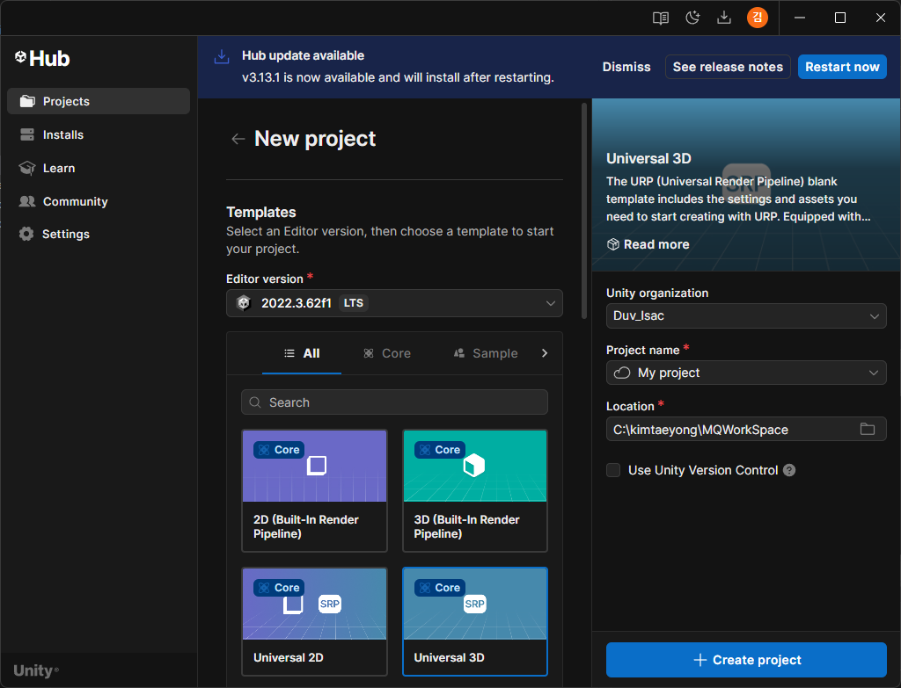
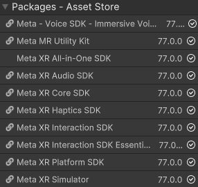
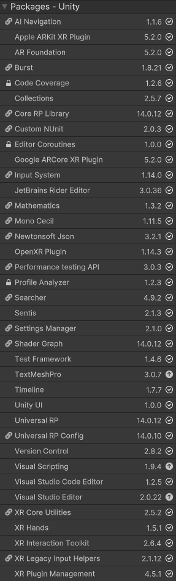
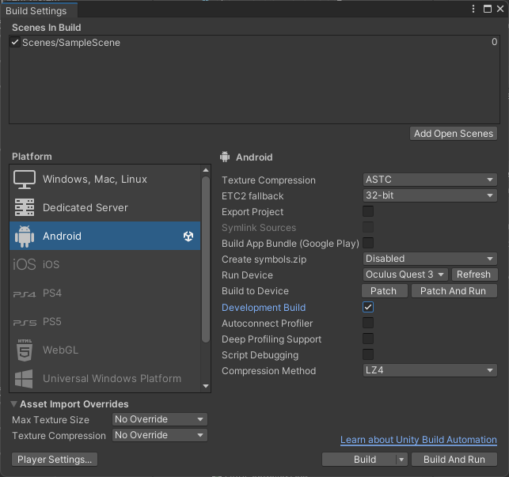
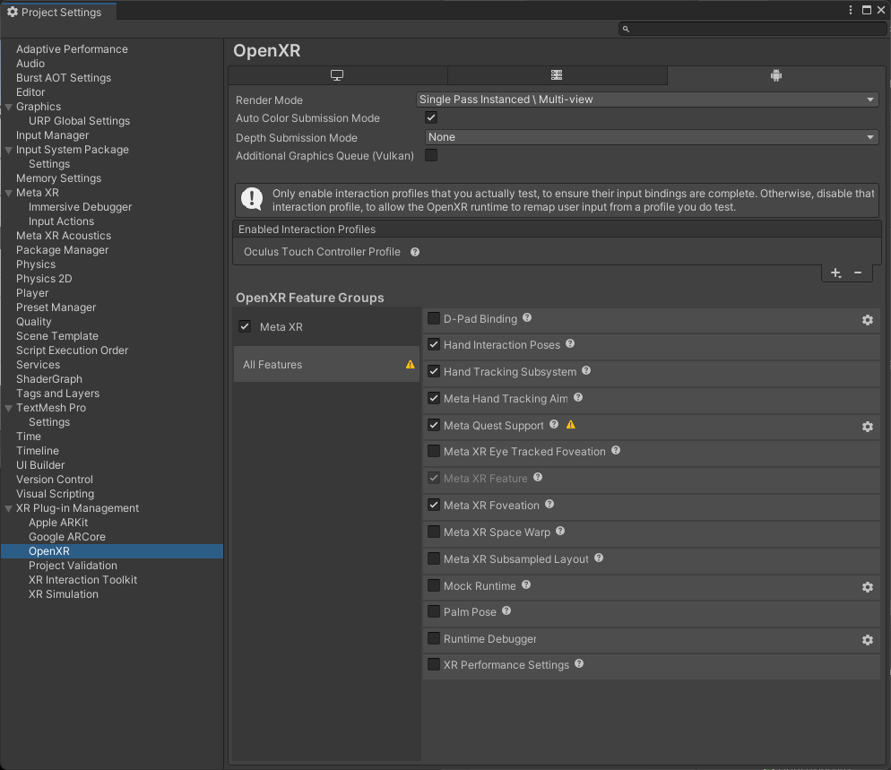

# UPDATE!!! (2025.8.11)  

### Package Manager 셋팅이 추가됨 사진 바꿨으니 알잘딱으로 다 설치하셈

# 프로젝트 생성
- Editer version 확인하기  
- Universal 3D 설정하기  
- 옆에 체크박스는 체크하지 않기 
  

# 기본 세팅

### Package Manager
[Meta XR All-in-One SDK](https://assetstore.unity.com/packages/tools/integration/meta-xr-all-in-one-sdk-269657?locale=ko-KR&gad_source=1&gad_campaignid=22802914714&gbraid=0AAAAADdkVOuwXt3If6DYiCmAVVIdg3GYB&gclid=CjwKCAjw7rbEBhB5EiwA1V49nbNFfPU0zXu-ZNAnxab4k47_T5YhVYjb_JkDb7n9O8BNab2PRxFc6xoCvGAQAvD_BwE&gclsrc=aw.ds) 에 들어가서 내 에셋에 추가하고 unity에서 실행 (아마 unity가 다시 시작될거임)  
unity에 추가하면 "OpenXR"이랑 "Oculus" 중에서 선택하는 창이 뜰텐데 "OpenXR" 선택

왼쪽 위에 "Window" - "Package Manager"에 들어가면 화면이 하나 나옴.  
왼쪽 위를 보면 "Packages: "가 있는데 이걸 "Unity Registry"로 바꾸고 검색 창에 아래 사진에 있는걸 다 install하면 됨.  

(위에서 Meta XR All-in-One SDK를 깔아서 조금만 더 깔으면 됨. 현재 깔려있는걸 확인하려면 "Unity Registry" 선택하던 탭에서 "My Assest"를 선택하면 됨.)  

  

### Build Settings & Project settings

왼쪽 위 "File" - "Build Settings" 에 들어가 아래처럼 바꾸기  
(Run Device는 메쿼3 가진 사람만의 특권임)  

하고나서 Switch Platform 누르기

아래 Player Setting으로 들어가기 들어가면 Project settings으로 이어짐  

이 창에서 할게 ㅈㄴ 많은데 [영상](https://www.youtube.com/watch?v=_xm-2sCvq44)의 1:28 ~ 2:47 까지를 따라하면 됨.  

계속 같은 창에서 왼쪽의 목록에 있는 "XR Plug-in Menagement" 클릭  

누가봐도 데스크탑 처럼 보이는거에서 OpenXR 누르고 안드로이드로 가서도 똑같이 누르면 됨 (밑에 체크박스 하나가 눌려진체로 생기는데 눌린 상태로 놔두셈)

"XR Plug-in Menagement" 밑에 "OpenXR" 누르고 아래처럼 만들기.

(Oculus Touch Controller Profile를 추가하는 방법은 '+' 누르고 추가하면 됨)

### SampleScene

처음 시작하면 "Main Camera"랑 "Global Volume"을 포함한 3개가 같이 생성되는데 언급한 2개는 삭제하면 됨.

### 이렇게 하면 끝!